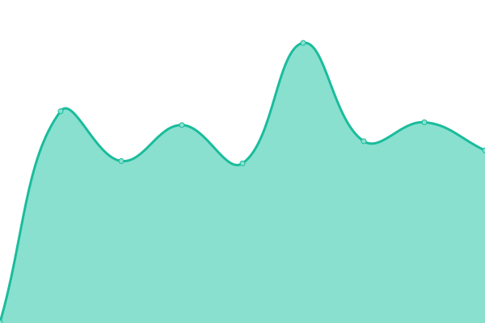

# [📈 Live Status](https://jacobfernandez917.github.io/concati-dokploy-upptime): <!--live status--> **🟧 Partial outage**

This repository contains the open-source uptime monitor and status page for [Jacob Fernandez](https://jacobfernandez917.github.io/concati-dokploy-upptime), powered by [Upptime](https://github.com/upptime/upptime).

With [Upptime](https://upptime.js.org), you can get your own unlimited and free uptime monitor and status page, powered entirely by a GitHub repository. We use [Issues](https://github.com/jacobfernandez917/concati-dokploy-upptime/issues) as incident reports, [Actions](https://github.com/jacobfernandez917/concati-dokploy-upptime/actions) as uptime monitors, and [Pages](https://jacobfernandez917.github.io/concati-dokploy-upptime) for the status page.

<!--start: status pages-->
<!-- This summary is generated by Upptime (https://github.com/upptime/upptime) -->
<!-- Do not edit this manually, your changes will be overwritten -->
<!-- prettier-ignore -->
| URL | Status | History | Response Time | Uptime |
| --- | ------ | ------- | ------------- | ------ |
|  [Caller ID API](http://52.76.231.243:10043) | 🟩 Up | [caller-id-api.yml](https://github.com/jacobfernandez917/concati-dokploy-upptime/commits/HEAD/history/caller-id-api.yml) | 

 400ms
     
 | 

<a href="https://jacobfernandez917.github.io/concati-dokploy-upptime/history/caller-id-api">100.00%</a>
    

|  [Consent Management API](http://52.76.231.243:10042) | 🟩 Up | [consent-management-api.yml](https://github.com/jacobfernandez917/concati-dokploy-upptime/commits/HEAD/history/consent-management-api.yml) | 

 405ms
     
 | 

<a href="https://jacobfernandez917.github.io/concati-dokploy-upptime/history/consent-management-api">100.00%</a>
    

|  [Device Identifier API](http://52.76.231.243:5008) | 🟩 Up | [device-identifier-api.yml](https://github.com/jacobfernandez917/concati-dokploy-upptime/commits/HEAD/history/device-identifier-api.yml) | 

 409ms
     
 | 

<a href="https://jacobfernandez917.github.io/concati-dokploy-upptime/history/device-identifier-api">85.86%</a>
    

|  [Device Status API](http://52.76.231.243:5007) | 🟩 Up | [device-status-api.yml](https://github.com/jacobfernandez917/concati-dokploy-upptime/commits/HEAD/history/device-status-api.yml) | 

 404ms
     
 | 

<a href="https://jacobfernandez917.github.io/concati-dokploy-upptime/history/device-status-api">100.00%</a>
    

|  [Device Status API - B](http://52.76.231.243:10039) | 🟩 Up | [device-status-api-b.yml](https://github.com/jacobfernandez917/concati-dokploy-upptime/commits/HEAD/history/device-status-api-b.yml) | 

 399ms
     
 | 

<a href="https://jacobfernandez917.github.io/concati-dokploy-upptime/history/device-status-api-b">100.00%</a>
    

|  [Device Swap API](http://52.76.231.243:5006) | 🟩 Up | [device-swap-api.yml](https://github.com/jacobfernandez917/concati-dokploy-upptime/commits/HEAD/history/device-swap-api.yml) | 

 405ms
     
 | 

<a href="https://jacobfernandez917.github.io/concati-dokploy-upptime/history/device-swap-api">100.00%</a>
    

|  [Device Swap API - B](http://52.76.231.243:10038) | 🟩 Up | [device-swap-api-b.yml](https://github.com/jacobfernandez917/concati-dokploy-upptime/commits/HEAD/history/device-swap-api-b.yml) | 

 403ms
     
 | 

<a href="https://jacobfernandez917.github.io/concati-dokploy-upptime/history/device-swap-api-b">100.00%</a>
    

|  [eSIM Provisioning API](http://52.76.231.243:10024) | 🟩 Up | [e-sim-provisioning-api.yml](https://github.com/jacobfernandez917/concati-dokploy-upptime/commits/HEAD/history/e-sim-provisioning-api.yml) | 

 408ms
     
 | 

<a href="https://jacobfernandez917.github.io/concati-dokploy-upptime/history/e-sim-provisioning-api">100.00%</a>
    

|  [Fraudster Blacklist History API](http://52.76.231.243:10015) | 🟩 Up | [fraudster-blacklist-history-api.yml](https://github.com/jacobfernandez917/concati-dokploy-upptime/commits/HEAD/history/fraudster-blacklist-history-api.yml) | 

 400ms
     
 | 

<a href="https://jacobfernandez917.github.io/concati-dokploy-upptime/history/fraudster-blacklist-history-api">100.00%</a>
    

|  [Fraudster Bulk Reporting API](http://52.76.231.243:10013) | 🟩 Up | [fraudster-bulk-reporting-api.yml](https://github.com/jacobfernandez917/concati-dokploy-upptime/commits/HEAD/history/fraudster-bulk-reporting-api.yml) | 

 402ms
     
 | 

<a href="https://jacobfernandez917.github.io/concati-dokploy-upptime/history/fraudster-bulk-reporting-api">100.00%</a>
    

|  [Fraudster Identification API](http://52.76.231.243:5000) | 🟩 Up | [fraudster-identification-api.yml](https://github.com/jacobfernandez917/concati-dokploy-upptime/commits/HEAD/history/fraudster-identification-api.yml) | 

 402ms
     
 | 

<a href="https://jacobfernandez917.github.io/concati-dokploy-upptime/history/fraudster-identification-api">100.00%</a>
    

|  [Fraudster Investigation Feedback API](http://52.76.231.243:10016) | 🟩 Up | [fraudster-investigation-feedback-api.yml](https://github.com/jacobfernandez917/concati-dokploy-upptime/commits/HEAD/history/fraudster-investigation-feedback-api.yml) | 

 402ms
     
 | 

<a href="https://jacobfernandez917.github.io/concati-dokploy-upptime/history/fraudster-investigation-feedback-api">100.00%</a>
    

|  [Fraudster MSISDN Check API](http://52.76.231.243:10011) | 🟩 Up | [fraudster-msisdn-check-api.yml](https://github.com/jacobfernandez917/concati-dokploy-upptime/commits/HEAD/history/fraudster-msisdn-check-api.yml) | 

 402ms
     
 | 

<a href="https://jacobfernandez917.github.io/concati-dokploy-upptime/history/fraudster-msisdn-check-api">100.00%</a>
    

|  [Fraudster MSISDN Submission API](http://52.76.231.243:10012) | 🟩 Up | [fraudster-msisdn-submission-api.yml](https://github.com/jacobfernandez917/concati-dokploy-upptime/commits/HEAD/history/fraudster-msisdn-submission-api.yml) | 

 404ms
     
 | 

<a href="https://jacobfernandez917.github.io/concati-dokploy-upptime/history/fraudster-msisdn-submission-api">100.00%</a>
    

|  [Fraudster Spam Number Verification API](http://52.76.231.243:10014) | 🟩 Up | [fraudster-spam-number-verification-api.yml](https://github.com/jacobfernandez917/concati-dokploy-upptime/commits/HEAD/history/fraudster-spam-number-verification-api.yml) | 

 401ms
     
 | 

<a href="https://jacobfernandez917.github.io/concati-dokploy-upptime/history/fraudster-spam-number-verification-api">100.00%</a>
    

|  [GeoScores API](http://52.76.231.243:10020) | 🟩 Up | [geo-scores-api.yml](https://github.com/jacobfernandez917/concati-dokploy-upptime/commits/HEAD/history/geo-scores-api.yml) | 

 401ms
     
 | 

<a href="https://jacobfernandez917.github.io/concati-dokploy-upptime/history/geo-scores-api">100.00%</a>
    

|  [GeoScores Frontend](http://52.76.231.243:10021) | 🟩 Up | [geo-scores-frontend.yml](https://github.com/jacobfernandez917/concati-dokploy-upptime/commits/HEAD/history/geo-scores-frontend.yml) | 

 405ms
     
 | 

<a href="https://jacobfernandez917.github.io/concati-dokploy-upptime/history/geo-scores-frontend">100.00%</a>
    

|  [Location Insights API](http://52.76.231.243:5010) | 🟩 Up | [location-insights-api.yml](https://github.com/jacobfernandez917/concati-dokploy-upptime/commits/HEAD/history/location-insights-api.yml) | 

 393ms
     
 | 

<a href="https://jacobfernandez917.github.io/concati-dokploy-upptime/history/location-insights-api">85.09%</a>
    

|  [Location Insights API - B](http://52.76.231.243:10041) | 🟥 Down | [location-insights-api-b.yml](https://github.com/jacobfernandez917/concati-dokploy-upptime/commits/HEAD/history/location-insights-api-b.yml) | 

 0ms
     
 | 

<a href="https://jacobfernandez917.github.io/concati-dokploy-upptime/history/location-insights-api-b">0.00%</a>
    

|  [Number Verification API](http://52.76.231.243:10028) | 🟩 Up | [number-verification-api.yml](https://github.com/jacobfernandez917/concati-dokploy-upptime/commits/HEAD/history/number-verification-api.yml) | 

 402ms
     
 | 

<a href="https://jacobfernandez917.github.io/concati-dokploy-upptime/history/number-verification-api">100.00%</a>
    

|  [OTP + Number Verification API](http://52.76.231.243:5001) | 🟩 Up | [otp-number-verification-api.yml](https://github.com/jacobfernandez917/concati-dokploy-upptime/commits/HEAD/history/otp-number-verification-api.yml) | 

 401ms
     
 | 

<a href="https://jacobfernandez917.github.io/concati-dokploy-upptime/history/otp-number-verification-api">100.00%</a>
    

|  [OTP + Number Verification - B](http://52.76.231.243:10037) | 🟩 Up | [otp-number-verification-b.yml](https://github.com/jacobfernandez917/concati-dokploy-upptime/commits/HEAD/history/otp-number-verification-b.yml) | 

 402ms
     
 | 

<a href="https://jacobfernandez917.github.io/concati-dokploy-upptime/history/otp-number-verification-b">100.00%</a>
    

|  [Quality on Demand API](http://52.76.231.243:5009) | 🟥 Down | [quality-on-demand-api.yml](https://github.com/jacobfernandez917/concati-dokploy-upptime/commits/HEAD/history/quality-on-demand-api.yml) | 

 0ms
     
 | 

<a href="https://jacobfernandez917.github.io/concati-dokploy-upptime/history/quality-on-demand-api">100.00%</a>
    

|  [Swim Swap API](http://52.76.231.243:10027) | 🟩 Up | [swim-swap-api.yml](https://github.com/jacobfernandez917/concati-dokploy-upptime/commits/HEAD/history/swim-swap-api.yml) | 

 421ms
     
 | 

<a href="https://jacobfernandez917.github.io/concati-dokploy-upptime/history/swim-swap-api">99.22%</a>
    

<!--end: status pages-->

[**Visit our status website →**](https://jacobfernandez917.github.io/concati-dokploy-upptime)

## 📄 License

- Powered by: [Upptime](https://github.com/upptime/upptime)
- Code: [MIT](./LICENSE) © [Anand Chowdhary](https://anandchowdhary.com), supported by [Pabio](https://pabio.com)
- Data in the `./history` directory: [Open Database License](https://opendatacommons.org/licenses/odbl/1-0/)
